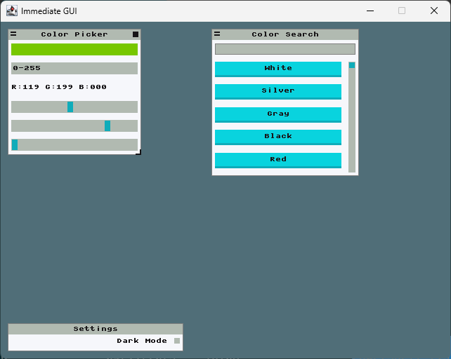

# 5. Color Picker

Welcome to the InterIm tutorial!

## Running the examples

You can run the code in this file (and other tutorials) with:

```bash
scala-cli 5-colorpicker.md example-minart-backend.scala
```

Other examples can be run in a similar fashion

## An advanced color picker example

In this last example you can see a complex InterIm application, with various types of components and features.

This example contains:
 - Colored rectangles
 - Text
 - Buttons
 - Sliders
 - Checkboxes
 - Text inputs
 - Elements that appear/disappear conditionally (search result slider)
 - Light/Dark mode
 - Fixed and dynamic layouts, nested
 - Movable and static windows
 - Mutable References
 - Components with different z-indexes (using `onTop` and `onBottom`)



This one is more of a show off of what you can do.

```scala
import eu.joaocosta.interim.*

val uiContext = new UiContext()

case class AppState(
  colorPickerArea: PanelState[Rect] = PanelState.open(Rect(x = 10, y = 10, w = 190, h = 180)),
  colorSearchArea: PanelState[Rect] = PanelState.open(Rect(x = 300, y = 10, w = 210, h = 210)),
  colorRange: PanelState[Int] = PanelState(false, 0),
  resultDelta: Int      = 0,
  color: Color          = Color(0, 0, 0),
  query: String         = ""
)
val initialState = AppState()

val htmlColors = List(
  "White"   -> Color(255, 255, 255),
  "Silver"  -> Color(192, 192, 192),
  "Gray"    -> Color(128, 128, 128),
  "Black"   -> Color(0, 0, 0),
  "Red"     -> Color(255, 0, 0),
  "Maroon"  -> Color(128, 0, 0),
  "Yellow"  -> Color(255, 255, 0),
  "Olive"   -> Color(128, 128, 0),
  "Lime"    -> Color(0, 255, 0),
  "Green"   -> Color(0, 128, 0),
  "Aqua"    -> Color(0, 255, 255),
  "Teal"    -> Color(0, 128, 128),
  "Blue"    -> Color(0, 0, 255),
  "Navy"    -> Color(0, 0, 128),
  "Fuchsia" -> Color(255, 0, 255),
  "Purple"  -> Color(128, 0, 128)
)

def textColor =
  if (skins.ColorScheme.darkModeEnabled()) skins.ColorScheme.white
  else skins.ColorScheme.black

def application(inputState: InputState, appState: AppState) =
  import eu.joaocosta.interim.InterIm.*

  ui(inputState, uiContext):
    appState.asRefs: (colorPickerArea, colorSearchArea, colorRange, resultDelta, color, query) =>
      onTop:
        window(id = "color picker", area = colorPickerArea, title = "Color Picker", closable = true, movable = true, resizable = true): area =>
          rows(area = area.shrink(5), numRows = 6, padding = 10): row =>
            rectangle(row(0), color.get)
            select(id = "range", row(1), Vector("0-255","0-100", "0x00-0xff"))(colorRange).value match
              case 0 =>
                val colorStr = f"R:${color.get.r}%03d G:${color.get.g}%03d B:${color.get.b}%03d"
                text(row(2), textColor, colorStr, Font.default, alignLeft, centerVertically)
              case 1 =>
                val colorStr = f"R:${color.get.r * 100 / 255}%03d G:${color.get.g * 100 / 255}%03d B:${color.get.b * 100 / 255}%03d"
                text(row(2), textColor, colorStr, Font.default, alignLeft, centerVertically)
              case 2 =>
                val colorStr = f"R:0x${color.get.r}%02x G:0x${color.get.g}%02x B:0x${color.get.b}%02x"
                text(row(2), textColor, colorStr, Font.default, alignLeft, centerVertically)
            val r = slider("red slider", row(3), min = 0, max = 255)(color.get.r)
            val g = slider("green slider", row(4), min = 0, max = 255)(color.get.g)
            val b = slider("blue slider", row(5), min = 0, max = 255)(color.get.b)
            color := Color(r, g, b)

      window(id = "color search", area = colorSearchArea, title = "Color Search", closable = false, movable = true): area =>
        dynamicRows(area = area.shrink(5), padding = 10): newRow =>
          val oldQuery = query.get
          textInput("query", newRow(16))(query)
          if (query.get != oldQuery) resultDelta := 0
          val results = htmlColors.filter(_._1.toLowerCase.startsWith(query.get.toLowerCase))
          val resultsArea = newRow(maxSize)
          val buttonSize = 32
          dynamicColumns(area = resultsArea, padding = 10): newColumn =>
            val resultsHeight = results.size * buttonSize
            if (resultsHeight > resultsArea.h)
              slider("result scroller", newColumn(-16), min = 0, max = resultsHeight - resultsArea.h)(resultDelta)
            val clipArea = newColumn(maxSize)
            clip(area = clipArea):
              rows(area = clipArea.copy(y = clipArea.y - resultDelta.get, h = resultsHeight), numRows = results.size, padding = 10): rows =>
                results.zip(rows).foreach:
                  case ((colorName, colorValue), row) =>
                    button(s"$colorName button", row, colorName):
                      colorPickerArea.modify(_.open)
                      color := colorValue

      onBottom:
        window(id = "settings", area = PanelState.open(Rect(10, 430, 250, 40)), title = "Settings", movable = false): area =>
          dynamicColumns(area = area.shrink(5), padding = 10): newColumn =>
            if (checkbox(id = "dark mode", newColumn(-16))(skins.ColorScheme.darkModeEnabled()))
              skins.ColorScheme.useDarkMode()
            else skins.ColorScheme.useLightMode()
            text(newColumn(maxSize).move(0, 4), textColor, "Dark Mode", Font.default, alignRight)
```

Let's run it:

```scala
MinartBackend.run(initialState)(application)
```
