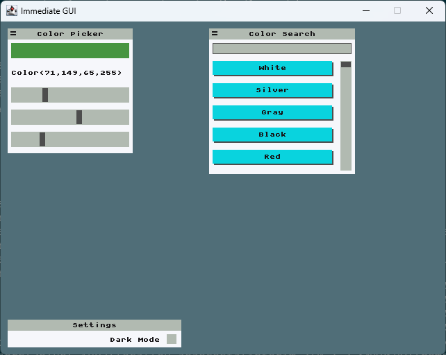

# 4. Color Picker

Welcome to the InterIm tutorial!

## Running the examples

You can run the code in this file (and other tutorials) with:

```bash
scala-cli --power colorpicker.md example-minart-backend.scala
```

Other examples can be run in a similar fashion

## An advanced color picker example

In this last example you can see a complex InterIm application, with various types of components and features.

This example contains:
 - Colored rectangles
 - Text
 - Buttons
 - Sliders
 - Checkboxes
 - Text inputs
 - Elements that appear/disappear conditionally (search result slider)
 - Light/Dark mode
 - Fixed and dynamic layouts, nested
 - Movable and static windows



This one is more of a show off of what you can do.

```scala
import eu.joaocosta.interim.*

val uiState = new UiState()

var colorPickerArea = Rect(x = 10, y = 10, w = 210, h = 210)
var colorSearchArea = Rect(x = 300, y = 10, w = 210, h = 210)
var resultDelta     = 0
var color           = Color(0, 0, 0)
var query           = ""

val htmlColors = List(
  "White"   -> Color(255, 255, 255),
  "Silver"  -> Color(192, 192, 192),
  "Gray"    -> Color(128, 128, 128),
  "Black"   -> Color(0, 0, 0),
  "Red"     -> Color(255, 0, 0),
  "Maroon"  -> Color(128, 0, 0),
  "Yellow"  -> Color(255, 255, 0),
  "Olive"   -> Color(128, 128, 0),
  "Lime"    -> Color(0, 255, 0),
  "Green"   -> Color(0, 128, 0),
  "Aqua"    -> Color(0, 255, 255),
  "Teal"    -> Color(0, 128, 128),
  "Blue"    -> Color(0, 0, 255),
  "Navy"    -> Color(0, 0, 128),
  "Fuchsia" -> Color(255, 0, 255),
  "Purple"  -> Color(128, 0, 128)
)

def application(inputState: InputState) =
  import eu.joaocosta.interim.InterIm._
  def textColor =
    if (skins.ColorScheme.darkModeEnabled()) skins.ColorScheme.white
    else skins.ColorScheme.black
  ui(inputState, uiState):
    colorPickerArea = window(id = "color picker", area = colorPickerArea, title = "Color Picker", movable = true) {
      area =>
        rows(area = area.shrink(5), numRows = 5, padding = 10) { row =>
          rectangle(row(0), color)
          text(row(1), textColor, color.toString, 8)
          val r = slider("red slider", row(2), min = 0, max = 255)(color.r)
          val g = slider("green slider", row(3), min = 0, max = 255)(color.g)
          val b = slider("blue slider", row(4), min = 0, max = 255)(color.b)
          color = Color(r, g, b)
        }
    }._2

    colorSearchArea = window(id = "color search", area = colorSearchArea, title = "Color Search", movable = true) {
      area =>
        dynamicRows(area = area.shrink(5), padding = 10) { newRow =>
          val newQuery = textInput("query", newRow(32))(query)
          query = newQuery
          if (query != newQuery) resultDelta = 0
          val results = htmlColors.filter(_._1.toLowerCase.startsWith(query.toLowerCase))
          dynamicColumns(area = newRow(maxSize), padding = 10) { newColumn =>
            if (results.size > 5)
              resultDelta = slider("result scroller", newColumn(-24), min = 0, max = results.size - 5)(resultDelta)
            rows(area = newColumn(maxSize), numRows = 5, padding = 10) { rows =>
              results.drop(resultDelta).zip(rows).foreach { case ((colorName, colorValue), row) =>
                if (button(s"$colorName button", row, colorName))
                  color = colorValue
              }
            }
          }
        }
    }._2

    window(id = "settings", area = Rect(10, 430, 250, 40), title = "Settings", movable = false) { area =>
      dynamicColumns(area = area.shrink(5), padding = 10) { newColumn =>
        if (checkbox(id = "dark mode", newColumn(-16))(skins.ColorScheme.darkModeEnabled()))
          skins.ColorScheme.useDarkMode()
        else skins.ColorScheme.useLightMode()
        text(newColumn(maxSize).move(0, 4), textColor, "Dark Mode", 8, alignRight)
      }
    }
```

Let's run it:

```scala
MinartBackend.run(application)
```
